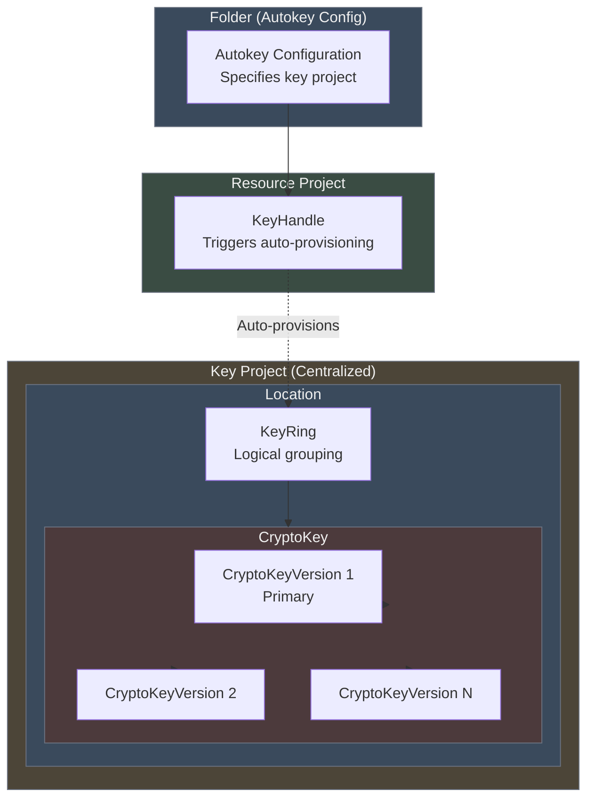
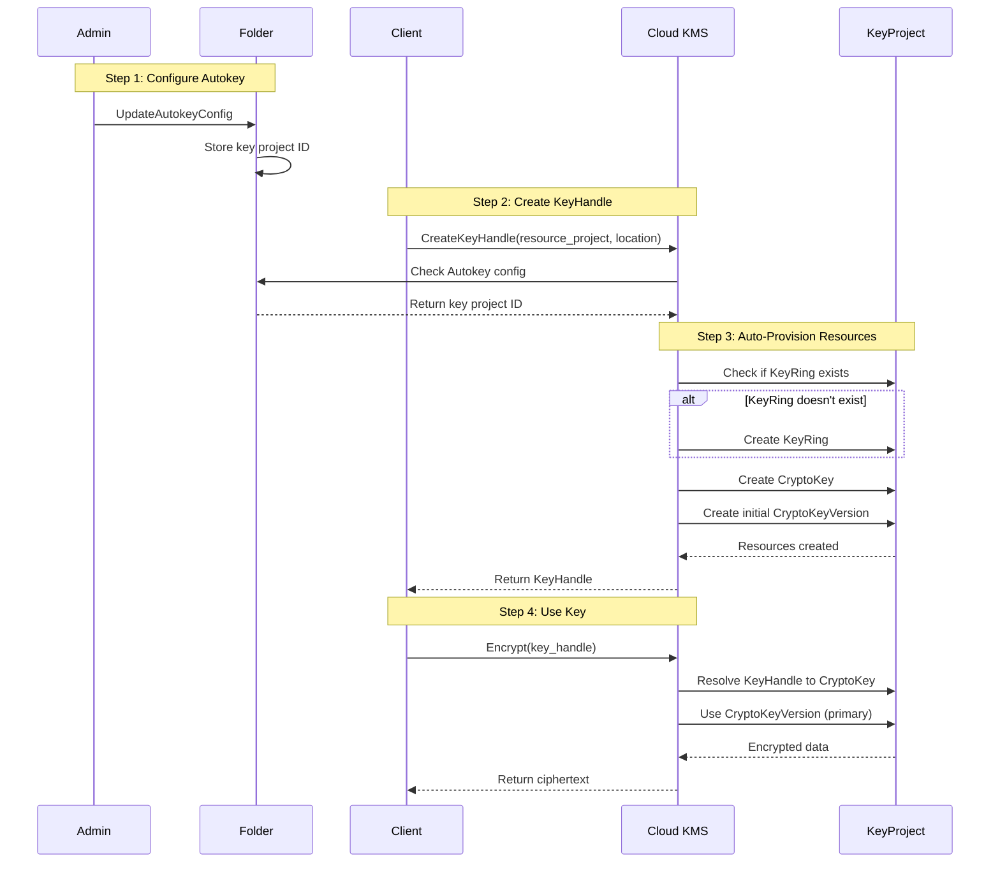
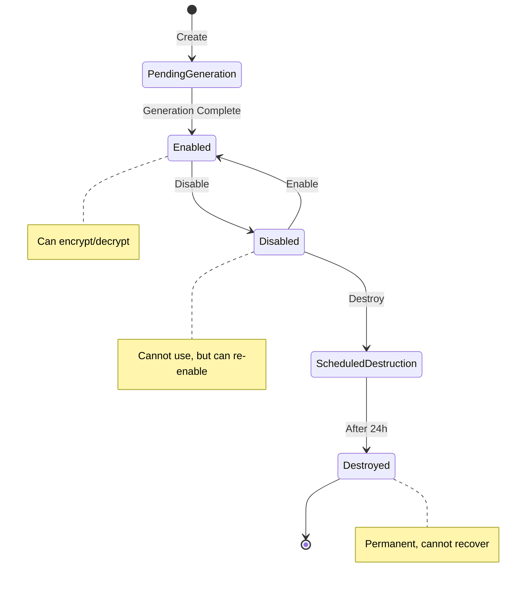

# GCP KMS Key Creation Flow

This document explains the complete flow for creating cryptographic keys in Google Cloud KMS, from KeyHandle through CryptoKeyVersion.

## Resource Hierarchy



## Complete Key Creation Flow



## Resource Relationships

### KeyHandle
- **Purpose:** Lightweight reference triggering automatic key provisioning
- **Location:** Resource project (where application lives)
- **Contains:** Pointer to actual CryptoKey in key project
- **Lifecycle:** Created by client, triggers Autokey

### KeyRing
- **Purpose:** Logical grouping of CryptoKeys
- **Location:** Key project (centralized)
- **Immutable:** Cannot be deleted once created
- **Naming:** projects/{project}/locations/{location}/keyRings/{keyring}

### CryptoKey
- **Purpose:** Logical key that can have multiple versions
- **Location:** Inside KeyRing
- **Properties:** Purpose (encrypt/decrypt, sign/verify), rotation schedule
- **Naming:** projects/{project}/locations/{location}/keyRings/{keyring}/cryptoKeys/{key}

### CryptoKeyVersion
- **Purpose:** Actual cryptographic key material
- **Location:** Inside CryptoKey
- **Lifecycle:** Created → Enabled → Disabled → Destroyed
- **Primary version:** The version used for new operations
- **Naming:** {cryptoKey}/cryptoKeyVersions/{version}

## Key Creation Process (Detailed)

### Phase 1: Autokey Configuration (One-Time Setup)

```
Folder
  └─ Autokey Configuration
       └─ Key Project: "central-keys-project"
```

**API Call:**
```
UpdateAutokeyConfig(
  parent: "folders/123456",
  keyProject: "projects/central-keys-project"
)
```

### Phase 2: KeyHandle Creation (Per Application)

```
Resource Project: "my-app-project"
  └─ KeyHandle: "my-database-key-handle"
       └─ Location: "us-east1"
```

**API Call:**
```
CreateKeyHandle(
  parent: "projects/my-app-project/locations/us-east1",
  keyHandleId: "my-database-key-handle"
)
```

### Phase 3: Automatic Provisioning (Behind the Scenes)

**KMS Autokey automatically creates:**

```
Key Project: "central-keys-project"
  └─ Location: "us-east1"
       └─ KeyRing: "autokey-keyring"
            └─ CryptoKey: "generated-key-abc123"
                 └─ CryptoKeyVersion: "1" (primary, enabled)
```

**Resources created:**
1. KeyRing (if doesn't exist): `projects/central-keys-project/locations/us-east1/keyRings/autokey-keyring`
2. CryptoKey: `{keyring}/cryptoKeys/generated-key-abc123`
3. CryptoKeyVersion: `{cryptoKey}/cryptoKeyVersions/1`

### Phase 4: Key Usage

**Client code:**
```go
// Encrypt using KeyHandle
req := &kmspb.EncryptRequest{
    Name: "projects/my-app-project/locations/us-east1/keyHandles/my-database-key-handle",
    Plaintext: []byte("sensitive data"),
}
response, _ := client.Encrypt(ctx, req)
```

**Behind the scenes:**
1. KMS resolves KeyHandle → CryptoKey in key project
2. Uses primary CryptoKeyVersion for encryption
3. Returns ciphertext

## Key Concepts

### Autokey Benefits
- **Centralized management:** All keys in one project
- **Automatic provisioning:** No manual KeyRing/CryptoKey creation
- **Resource separation:** Application project ≠ key project
- **On-demand creation:** Keys created when first needed

### KeyHandle vs Direct CryptoKey
- **KeyHandle:** Indirect reference, triggers auto-provisioning
- **Direct CryptoKey:** Must create KeyRing, CryptoKey, CryptoKeyVersion manually
- **Trade-off:** Convenience vs control

### Resource Naming
```
KeyHandle:
  projects/{resource-project}/locations/{location}/keyHandles/{handle-id}

CryptoKey (auto-created):
  projects/{key-project}/locations/{location}/keyRings/{ring}/cryptoKeys/{key}

CryptoKeyVersion:
  {cryptoKey}/cryptoKeyVersions/{version}
```

## State Diagram: CryptoKeyVersion Lifecycle



## Implementation Considerations for Emulator

### Minimum Viable KMS Emulator

**Must implement:**
1. KeyRing management (create, get, list)
2. CryptoKey management (create, get, list, update)
3. CryptoKeyVersion management (create, destroy, enable, disable)
4. Encryption operations (encrypt, decrypt)
5. Version state transitions (pending → enabled → disabled → destroyed)

**Optional for v1:**
- KeyHandle + Autokey (complex, can start with direct CryptoKey creation)
- Signing operations (asymmetric keys)
- MAC operations
- Import/export functionality
- HSM integration (not needed for local testing)

### Complexity Comparison

**Secret Manager:**
- 12 API methods total
- Simple CRUD operations
- One resource type (secrets + versions)

**KMS:**
- 50+ API methods
- Complex cryptographic operations
- Multiple resource types (KeyRing, CryptoKey, CryptoKeyVersion, KeyHandle)
- Actual encryption/decryption (need crypto library)
- State machine management (version lifecycle)

**KMS is significantly more complex than Secret Manager.**
